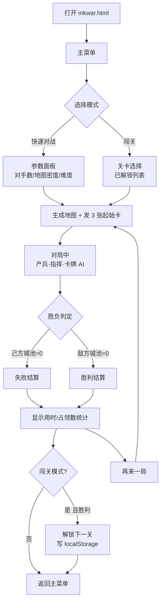
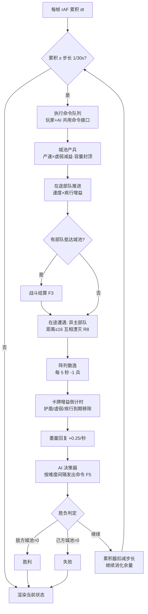
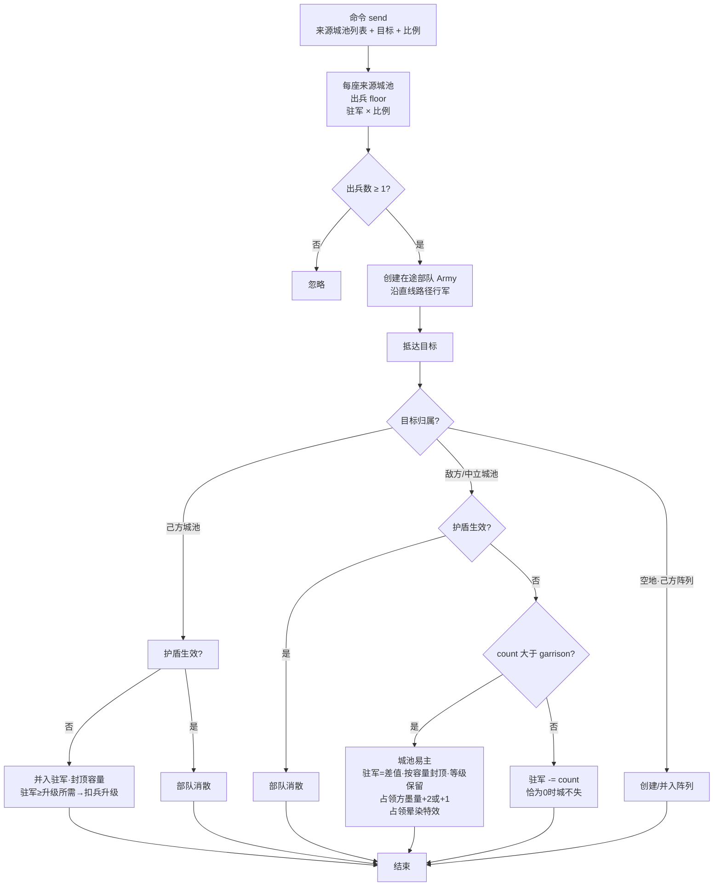
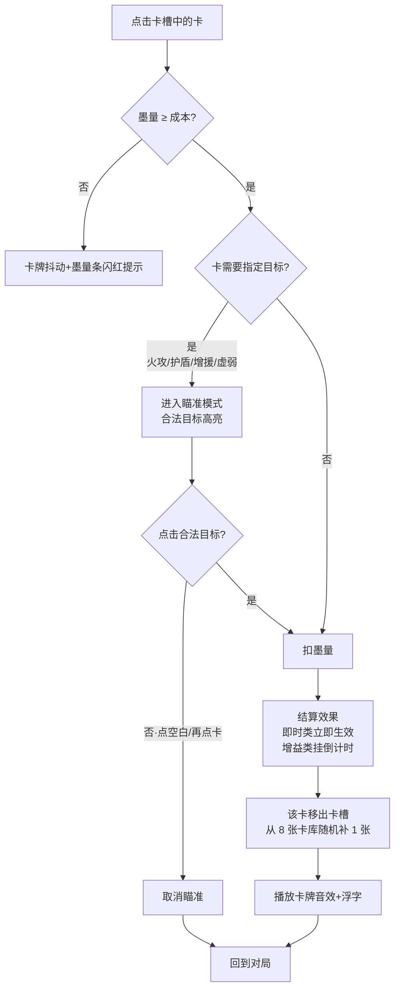
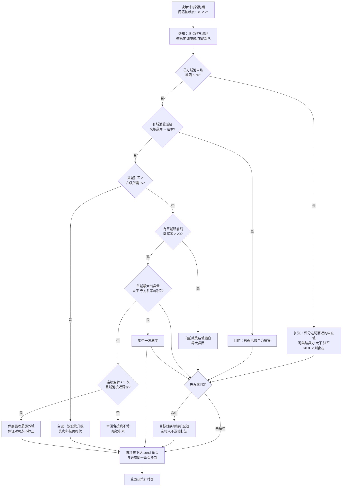

# 墨战（project8）需求文档

> 水墨风 State.io 类 RTS 城池攻防 + 战术卡牌 · 纯前端单机版
> 版本 v1.0 · 2026-10-06 · 配套：[架构设计](./架构设计.md) · [可视化原型](./prototype.html)

---

## 1. 项目概述

### 1.1 背景

墨战是一款水墨风格的 2D 城池攻防策略游戏，核心玩法与《State.io》同源：以颜色（墨色）为代表阵营，开局拥有一座城池，城池自动产兵，通过派兵攻占其余城池扩大产兵网络，最终占领全部敌方城池取胜。墨战的差异化在于**卡牌策略层**（火攻、护盾、借刀杀人等战术卡）与**水墨世界观**（墨色相溶、宣纸、印章、楷体）。

### 1.2 本期目标

| 项 | 内容 |
|---|---|
| 平台 | 浏览器（桌面 + 移动端），纯前端零依赖单文件 HTML，双击即玩 |
| 模式 | 快速对战（1v1 / 1v2 / 1v3 AI）+ 闯关（10 关递进解锁） |
| 单局时长 | 3~5 分钟 |
| 核心体验 | 「框选—派遣—扩张」的微操快感 + 卡牌临门一脚的博弈感 + 水墨视觉氛围 |
| 明确不做（远期规划） | 联机对战、日卡养成 / 抽卡商城、在途部队互战、动态地形（河流改道等）、皮肤系统 |

### 1.3 用户与场景

- 碎片时间玩家：手机竖屏/横屏、桌面浏览器，随时开一局。
- 策略玩家：通过屯兵列阵、卡牌组合实现以弱胜强。

---

## 2. 玩法需求

### 2.1 核心规则

| 编号 | 规则 |
|---|---|
| R1 | 地图由 8~14 座城池构成，分为：己方 1 座、每名 AI 1 座、其余中立（墨灰色） |
| R2 | 所有城池随时间自动产兵，产速与容量由等级决定（见 2.4 数值表） |
| R3 | 派兵攻击敌方/中立城池：驻军与来犯部队互耗；**来犯兵力 > 驻军时城池易主**，剩余兵力成为新城防，等级保留 |
| R4 | 派兵至己方城池为增援：直接并入驻军；若驻军 ≥ 升级所需，**自动扣兵升级**（Lv3 封顶），溢出部分保留至容量上限 |
| R5 | 胜利：地图上不存在敌方城池（中立城不强制）；失败：己方城池数归零（在途部队不延续寿命） |
| R6 | 屯兵列阵：框选己方城池后点击**空地**，所选部队出城在该点列阵待命；阵列可被再次框选派遣；阵列每 5 秒散逸 1 兵（墨迹风化），不可为 0 时散尽 |
| R7 | 阵列与城池不发生战斗交互（位置公开，风险自负——蓄兵是双刃剑） |
| R8 | **在途互战（墨色相溶）**：不同阵营的在途部队行军途中相遇（距离 ≤ 16 虚拟像素）即互相湮灭，双方按较小兵力扣减，全灭一方消失；胜出部队继续向原目标行军 |

### 2.2 操作需求

| 编号 | 操作 | 行为 |
|---|---|---|
| O1 | 点击己方城池 | 选中（可叠加多选）；点击已选中城池取消 |
| O2 | 按下拖动 | 框选：与矩形相交的所有己方城池/己方阵列加入选择 |
| O3 | 选中后点击敌方/中立城池 | 以当前比例（50%/100%）从每座选中城池出兵进攻 |
| O4 | 选中后点击己方城池 | 增援（同 O3 规则并入驻军、可触发升级） |
| O5 | 选中后点击空地 | 出兵列阵（R6） |
| O6 | 点击比例按钮 | 切换派遣比例 50% ↔ 100%（默认 100%） |
| O7 | 点击卡牌 → 点击目标城池 | 发动战术卡；再次点击卡牌或 ESC/空白处取消发动 |
| O8 | 空格 / 按钮 | 暂停 / 继续 |
| O9 | 触屏 | 与鼠标等价：单指拖=框选，点按=选择/派遣；控件热区 ≥ 44px |

### 2.3 卡牌需求（8 张次卡）

墨量：卡牌资源，上限 10，开局 3，**每秒 +0.25**；占领敌城 +2、占领中立 +1。
卡槽 3 张，开局随机发 3 张，打出后从卡库随机补 1（允许重复，简单规则优先公平）。

| 卡名 | 成本 | 目标 | 效果 |
|---|---|---|---|
| 火攻 | 5 | 敌/中立城 | 烧毁目标 40% 驻军（向下取整） |
| 护盾 | 4 | 己方城 | 8 秒内目标城免疫外来部队（来犯即消散），持续期间仍正常产兵 |
| 增援 | 4 | 己方城 | 目标城立即 +25 兵（不触发升级判定） |
| 虚弱 | 4 | 敌城 | 10 秒内目标城产速减半 |
| 疾行 | 3 | 无 | 10 秒内己方所有在途部队与阵列派遣行军速度 ×2 |
| 借刀 | 6 | 无 | 距己方主城最近的 1 座中立城立即倒戈为己方（连同驻军） |
| 围魏救赵 | 5 | 无 | 敌方所有在途部队立即折返，回到各自出发城池（视为敌方增援） |
| 墨涌 | 6 | 无 | 己方所有城池各 +8 兵 |

### 2.4 数值表（代码唯一事实源 `CFG`，本表与代码同步维护）

**城池等级**

| 等级 | 产速（兵/秒） | 容量上限 | 升级消耗（增援抵达时自动扣除） |
|---|---|---|---|
| Lv1 | 0.7 | 35 | → Lv2 需 20 |
| Lv2 | 1.2 | 70 | → Lv3 需 50 |
| Lv3 | 1.8 | 110 | —（封顶） |

**行军与战斗**

| 参数 | 值 |
|---|---|
| 虚拟地图尺寸 | 1600 × 900（渲染时等比缩放） |
| 行军速度 | 120 虚拟像素/秒（疾行 ×2） |
| 在途遭遇半径 | 16 虚拟像素（异主部队相遇互相湮灭，R8） |
| 占领判定 | 来犯 count > 驻军 garrison 才易主；剩余兵力按新城池容量封顶 |
| 中立城初始驻军 | 10~25（随机） |
| 双方主城初始驻军 | 20（闯关高关卡 AI +10~20） |
| 城池最小间距 | 240 虚拟像素（泊松盘采样保证） |

**墨量与卡牌**

| 参数 | 值 |
|---|---|
| 墨量上限 / 初始 | 10 / 3 |
| 墨量回复 | +0.25/秒 |
| 占领敌城 / 中立 | +2 / +1 |
| 卡槽 | 3 张 |

**AI 难度**（失误 = 目标选错而非无脑送兵；行为优先级：扩张 → 回防 → 升级 → 前线集结 → 进攻 → 满仓保底强攻）

| 难度 | 决策间隔 | 失误率 | 扩张比例 | 进攻比例 | 进攻阈值 | 行为特征 |
|---|---|---|---|---|---|---|
| 容易 | 2.2s | 40% | 50% | 100%（全力） | 守方驻军 ×0.85 | 常打错目标、扩张保守 |
| 普通 | 1.4s | 15% | 60% | 90% | 守方驻军 ×0.95 | 会回防、会升级 |
| 困难 | 0.8s | 5% | 70% | 90% | 守方驻军 ×1.0 | 先爬等级再打、会用火攻卡、只打有把握的仗 |

（进攻阈值 = 单城最大出兵量需超过的守方驻军倍率；未达阈值时 AI 继续积累升级。）

### 2.5 系统需求清单

- **对局系统**：地图生成（泊松盘）、固定步长模拟、战斗结算、胜负判定。
- **指挥系统**：点选/框选/派遣/列阵/比例切换（O1~O9）。
- **卡牌系统**：墨量、3 卡槽、摸牌循环、8 张卡效果与目标选择模式。
- **AI 系统**：三档难度，与玩家共用同一命令接口。
- **进度系统**：闯关解锁、最快胜利用时、音效开关（localStorage，前缀 `ink.`）。
- **反馈系统**：WebAudio 合成音效（点选/出兵/占领/卡牌/胜负）、占领晕染特效、浮字提示。
- **响应式系统**：桌面/手机竖屏/手机横屏三套布局，触屏虚拟按钮。

---

## 3. 流程图

### F1 整体游戏流程



### F2 对局主循环（固定步长模拟）



### F3 派兵与战斗结算



### F4 卡牌使用流程



### F5 AI 决策流程



---

## 4. 产品原型图（线框）

> 高保真可视化版本见 [prototype.html](./prototype.html)，以下为等价的字符线框。

### P1 主菜单（桌面横屏 / 手机竖屏共用一套纵向布局）

```
┌────────────────────────────────────────────────┐
│              墨  战              〔印：墨战〕    │
│        —— 笔落惊风雨 · 一局定江山 ——           │
│                                                │
│   ┌──────────────────────────────────────┐    │
│   │           ⚔  快 速 对 战             │    │
│   │   对手 [1][2][3]   地图 [小][中][大]  │    │
│   │   难度 [容易][普通][困难]             │    │
│   │        ┌────────────────┐            │    │
│   │        │    开 战 ！     │            │    │
│   │        └────────────────┘            │    │
│   └──────────────────────────────────────┘    │
│   ┌──────────────────────────────────────┐    │
│   │           卷  闯  关  5/10           │    │
│   │   ①②③④⑤⑥⑦⑧⑨⑩  已解锁高亮        │    │
│   └──────────────────────────────────────┘    │
│   ♪ 音效开    最快胜利 3:21                    │
└────────────────────────────────────────────────┘
```

### P2 对局界面（桌面横屏，地图为主 + 底部卡牌栏）

```
┌──────────────────────────────────────────────────────────┐
│ 墨量 ▓▓▓▓▓▓░░░░ 6.5   用时 2:14   敌城 3   我城 5  ‖暂停  │
│                                                          │
│        ╭城● ╭城○（框选中：金色描边+比例角标）             │
│      ╭城●      ＼                                        │
│         ＼ ●●●●→  ←行军队列（墨点串）                    │
│    ╭城◐        ╭城● ←──┘                                 │
│         ●●●●→ ╭城○                                      │
│    ╭城◦（中立·灰）    ▢城●（阵列：待命驻点）              │
│                                                          │
│ [50%|100%]  ┌────┐ ┌────┐ ┌────┐      框选中：3 城       │
│             │火攻│ │护盾│ │疾行│   （点击目标派遣）      │
│             │ 5墨│ │ 4墨│ │ 3墨│                          │
│             └────┘ └────┘ └────┘                          │
└──────────────────────────────────────────────────────────┘
   ●我方朱砂  ○/●敌方黛青·赭石·黛绿  ◐交战中  ◦中立墨灰
```

### P3 对局界面（手机竖屏：地图占上部，卡牌栏加高，比例按钮加大）

```
┌──────────────┐
│ 墨 6.5 ⏱2:14 │
│ 我5 敌3  ‖   │
├──────────────┤
│              │
│   ╭城●  ╭城○ │
│  ●●●●→      │
│   ╭城◦  ╭城● │
│      ╭城◐    │
│              │
├──────────────┤
│ [50|100]     │
│ ┌──┐┌──┐┌──┐│
│ │火││盾││疾││
│ └──┘└──┘└──┘│
└──────────────┘
```

### P4 结算 overlay（胜利 / 失败共用，印章区分）

```
┌────────────────────────────┐
│        ┌────────┐          │
│        │ 胜 印  │  ←朱砂印 │
│        └────────┘          │
│       江山尽入吾墨          │
│      用时 3:21 · 占领 7 城   │
│   ┌────────┐ ┌─────────┐   │
│   │ 再来一局 │ │ 返回大厅 │   │
│   └────────┘ └─────────┘   │
└────────────────────────────┘
   （失败：玄墨印「卷土重来未可知」）
```

### 交互标注

1. 框选：拖动产生半透明朱砂矩形，与矩形相交的己方城池即时高亮。
2. 派遣：出兵城池播放「笔锋收势」收缩动画，行军部队为 3~5 个墨点组成的队列。
3. 占领：城池颜色晕染过渡（0.6s），外圈墨晕扩散两环。
4. 卡牌瞄准：合法目标持续脉冲描边，非法目标置灰。
5. 墨量不足：卡牌左右抖动 + 墨量条闪红 0.4s。

---

## 5. 非功能需求

| 编号 | 需求 |
|---|---|
| N1 | 零依赖：不引用任何 CDN/字体/图片文件，单 HTML 双击即玩 |
| N2 | 响应式：画布尺寸 `min(固有宽, 视口宽, 视口高 × 宽高比)` 三重约束（dvh 优先、vh 回退）；手机竖屏地图上置、卡牌栏下置；桌面矮窗口与手机横屏有专属断点 |
| N3 | 触屏：坐标换算一律走 `getBoundingClientRect` 缩放比；控件热区 ≥ 44px；`touch-action: none` 防滚动冲突 |
| N4 | 性能：可见部队实体 ≤ 300；HUD DOM 更新节流 250ms；模拟固定步长 1/30s，渲染 rAF 全量重绘 |
| N5 | 音效：WebAudio 振荡器合成（无音频文件），可开关，状态存 localStorage |
| N6 | 存档：`ink.progress`（闯关进度）、`ink.best`（最快胜利）、`ink.sound`、`ink.cfg`（上次快速对战配置） |
| N7 | 逻辑可测：模拟核心为纯函数层（与 DOM 无关），Node 可无头运行并断言不变量 |

---

## 6. 验收标准

- [ ] 快速对战 1v1/1v2/1v3 均可完整开局至胜负结算，无报错
- [ ] 框选多城 → 群发 50%/100% → 行军 → 占领全链路正确（占领后产速提升、颜色晕染、溢出按容量封顶）
- [ ] 己方城池增援可自动升级至 Lv3，容量封顶不溢出
- [ ] 8 张卡牌效果与 2.3 表一致；墨量不足无法发动且有明显反馈
- [ ] 列阵屯兵：出兵→待命→再派遣→散逸全链路正确
- [ ] **在途互战**：不同阵营部队相遇互相湮灭，胜出部队继续行军（单测 + AI 采样局均验证）
- [ ] 三档 AI 均能完成扩张/回防/升级/集结/进攻行为，对局无僵局，困难 AI 显著强于容易 AI（无头模拟胜率 > 60%）
- [ ] 闯关 10 关逐关解锁，进度刷新后保留
- [ ] 手机竖屏（375×667）、手机横屏、桌面矮窗口均完整可见可操作
- [ ] `node tools/verify-sim.js` 全部断言通过
- [ ] 音效正常、可开关；暂停/继续/再来一局/返回大厅流程通顺

---

## 7. 远期规划（不在本期）

1. **联机对战**：本期已按「固定步长 + 命令驱动 + 逻辑渲染分离」实现，未来可将玩家/AI 命令流替换为网络输入流接入帧同步（详见架构文档第 8 节）。
2. **卡牌扩展**：日卡（每日清空的养成向）、稀有度（白/蓝/紫/橙）、300+ 卡池、组合技（连铳塔+火焰等）。
3. **防御塔与地形**：墨炮、箭塔、鬼爪塔、染色塔；窄道/开阔地；河流改道、桥梁坍塌。
4. **外围系统**：匹配、军衔、排行榜、皮肤、抽奖。
